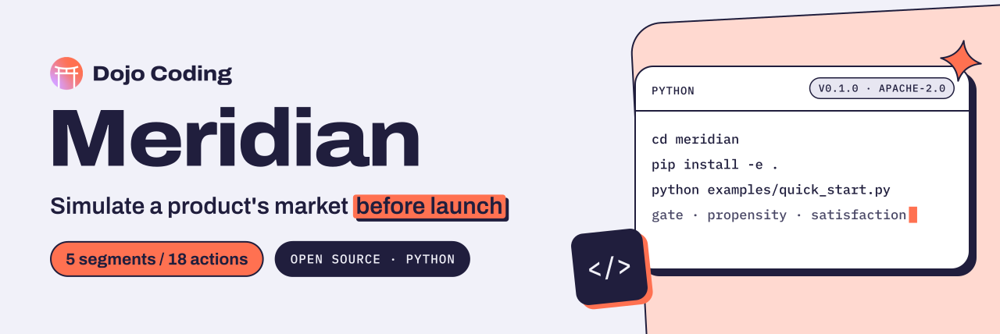

<p align="center">
  <a href="https://dojocoding.io">
    <picture>
      <source media="(prefers-color-scheme: dark)" srcset="docs/assets/banner-dark.svg">
      <source media="(prefers-color-scheme: light)" srcset="docs/assets/banner-light.svg">
      
    </picture>
  </a>
</p>

# Meridian

**A Python engine that models buyers as agents with budgets, adoption curves and social influence, for builders who want to test a product's pricing before launch.**

Product Profitability Prediction Engine: swarm intelligence meets economic simulation. Predict market reception, conversion dynamics, and revenue potential before launch.

[](LICENSE) [](pyproject.toml) [](https://www.python.org)

[Get started](#get-started) · [What it is](#what-it-is) · [Presets](#presets) · [Report an issue](https://github.com/DojoCodingLabs/meridian/issues/new)

## What it is

Meridian simulates the market for a product with buyer agents. Each agent has an economic profile (income, current spend, budget flexibility, purchasing power, price sensitivity, social influence, brand loyalty) and belongs to one of five segments of the technology adoption lifecycle, from innovators to laggards.

- **Economic gate**: hard budget rules with no LLM, to drop the offers an agent cannot afford before it decides.
- **Propensity engine**: the odds of awareness, interest, trial start, trial to paid, churn, referral and review, with base rates from SaaS benchmarks (20% trial to paid, 6% monthly churn).
- **Satisfaction engine**: a score per agent that moves each tick with product use, friends' opinions, reviews, price changes and competitor launches.
- **Populations**: any number of agents across segments and countries, with purchasing power factors for the US and nine Latin American countries.
- **Market platform**: a fork of [OASIS](https://github.com/camel-ai/oasis) by CAMEL-AI, where LLM agents post, follow and comment on a simulated social network. Meridian adds 18 economic actions, among them `browse_products`, `start_trial`, `subscribe`, `cancel_subscription`, `write_review` and `refer_friend`, backed by SQLite tables for products, tiers, trials, subscriptions, transactions, wallets, reviews, referrals and funnel events.

Version 0.1.0 is the simulation core. The gate, propensity and satisfaction engines are not yet called by the agents or the platform, and `cli/`, `meridian/analysis/`, `meridian/counterfactual/` and `meridian/knowledge/` are empty packages, so the `meridian simulate`, `meridian report` and `meridian compare` commands that `quick_start.py` lists as next steps do not exist yet.

## Get started

Meridian needs Python 3.10, 3.11 or 3.12.

```bash
git clone https://github.com/DojoCodingLabs/meridian.git
cd meridian
pip install -e .
python examples/quick_start.py
```

`pip install -e .` installs the dependencies in `pyproject.toml`, including CAMEL, sentence-transformers and the Neo4j driver. The quick start needs none of them, so it also runs right after cloning: budget checks for two sample buyers, 1,000 trial-to-paid and churn draws per segment, ten months of satisfaction and a 200-agent population across nine countries.

The same core from Python:

```python
from meridian.market_agent.economic_behavior import EconomicGate, EconomicProfile, PropensityEngine
from meridian.market_agent.segment import generate_agent_population

buyer = EconomicProfile(monthly_income=150.0, current_monthly_spend=15.0, currency_ppp=0.35,
                        adoption_curve="early_adopter", price_sensitivity=0.85)

EconomicGate.can_afford(buyer, 47.0)          # tier 1: can this buyer pay $47/mo at all?
odds = PropensityEngine.trial_to_paid_propensity(buyer, 47.0, satisfaction=7.0)
PropensityEngine.evaluate(odds)               # tier 2: one weighted draw, True or False

agents = generate_agent_population(200, country_distribution={"Costa Rica": 0.5, "Mexico": 0.5})
```

## Presets

YAML descriptions of a product to simulate: tiers and prices, the trial, competitors, agent count and timesteps, segment and country mix, allowed actions, report sections and what-if scenarios. No code reads them yet.

| Preset | What it describes |
|---|---|
| [`generic_saas`](presets/generic_saas/config.yaml) | A template to customize: free, pro ($29/mo) and enterprise ($99/mo) tiers, a 14-day trial, two competitors, 100 agents over 30 timesteps |
| [`dojos`](presets/dojos/config.yaml) | DojoOS, Dojo Coding's platform: free, Pro ($47/mo) and VIP ($297/mo) tiers, a 7-day trial, five competitors, 200 agents across nine Latin American countries, five what-if scenarios and ten [personas](presets/dojos/personas.json) |

## License

[Apache 2.0](LICENSE). Built by [Dojo Coding](https://dojocoding.io). Files that came from [OASIS](https://github.com/camel-ai/oasis) keep their CAMEL-AI copyright headers.

<p align="center">
  <a href="https://dojocoding.io"></a>
</p>
